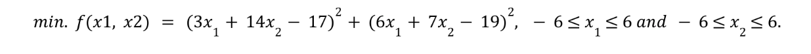

## Single-state Optimization

To use the techniques of the single-state methods to minimize the objective function in search space.

#### Objective function

#### Single-state optimization methods

